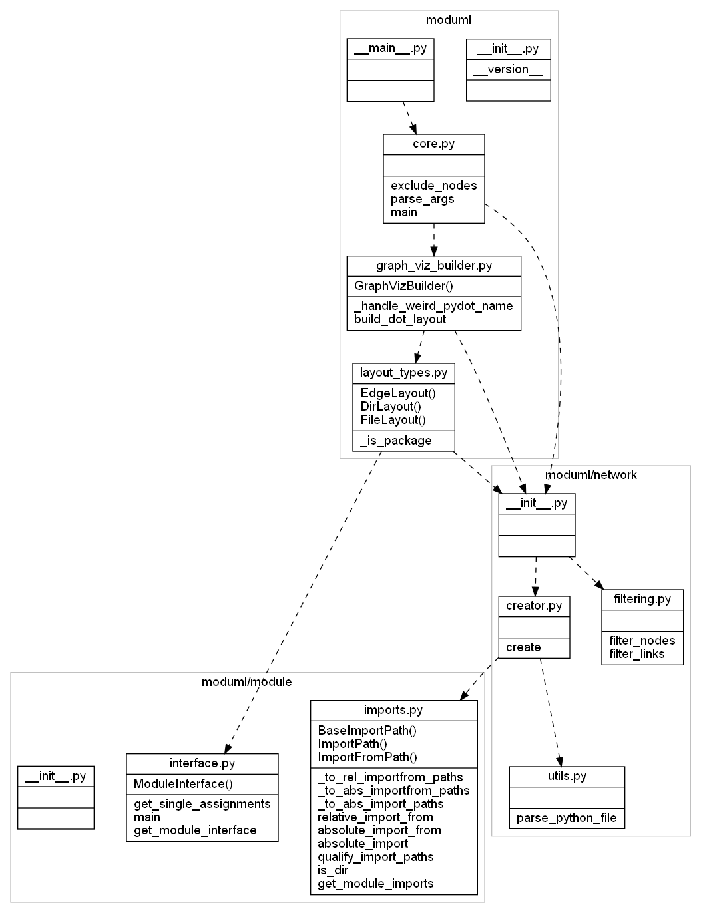

# moduml

## Purpose
A Python module for representing python code (modules and packages) as UML-inspired class diagrams.
Similarly to the intended role of UML diagrams in static languages, moduml is intented to help with getting an overview and comprehending a python code base at a higher level. Without looking at the code itself via an editor.

## Quick example
moduml applied to itself:  
``moduml moduml --output-file moduml_example.png --show-interface --show-imports --dir-as cluster``

## Caveats
- Static analysis + dynamic language = rough approximation. But most python code is written in a static fashion.
- Requires GraphViz for visualization. Without this installed it is only possible to get the textual representation (feed it to an online GraphViz site if needed).
- Needs testing!
- Hobby project that evolved from something else. Custom (read: sub-optimal) language analysis.

## Features
1. Graphical outline with directory hierarchy and file/module "interface" (globally defined functions, vars and types).
2. Import dependencies between modules and packages.

## How-to-use
``moduml <dir> [options]``

## Todos

### minor fixes
- add spacing options via nodesep and ranksep
- add choices to args
- show full filepaths with a dot "." instead of slash "/"
- make concentrate, i.e. combine edges, an option (it combines edges of different types, i.e. hierarchy and imports)
- option to remove/not-draw nodes with no edges/links.
- consider option for defining the number of parents to show in "full"-filepath, e.g. (path/to/file.py) --> to/file.py

### small features
- ~~add option for focusing on pattern-specified files, only showing the matched files along with their immediate neighbors (imports + hiearchy edges in both directions).~~
- add option for highlightning files that import specified external packages, e.g. all files importing numpy
- add a couple of sensible default views, that ignores other specific args (or just overwrites the ones it uses), e.g. interface-view (dir-as node, only hiearchy imports, show-interface)

### large features
- make a metrics view, that visualize code metrics, e.g. num of lines, with the actual number and a color indicating the relative size
- make a functions view, that show how functions in each file import each other
- make a class view, which only shows the actual code class view (like the rest of the code). Unlike pylints pyreverse, that tries to assemble the actual classes, e.g. looks inside methods to see if fields/variables are defined on self without explicitly being defined in the __init__ method.
- consider option for combining multiple files into one (based on glob pattern?), in order to simplify layout (reduce number of edges).
- consider coloring schemes for showing dir hierarchies and import links, e.g. top-level files have different kinds of red and their import links share the source node color.
- streamlit app for exploring moduml's own source code (hosted as a streamlit share service).
- config file for style definitions, e.g. color schemes, node shapes, etc.
